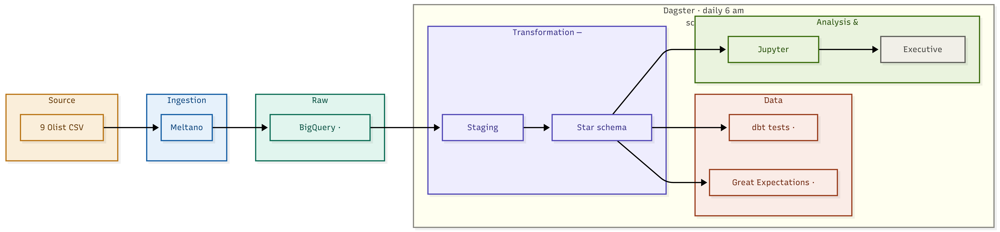
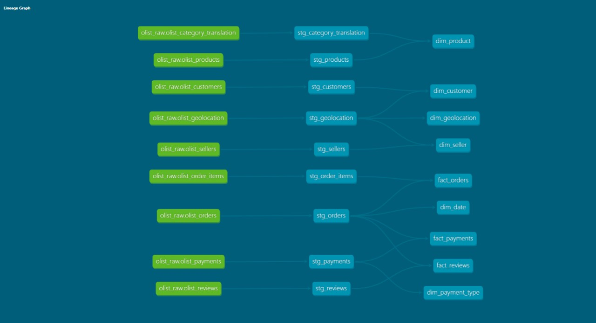

# Olist E-Commerce Data Pipeline

An end-to-end data engineering pipeline built on the [Brazilian E-Commerce Dataset by Olist](https://www.kaggle.com/datasets/olistbr/brazilian-ecommerce), covering ingestion, transformation, data quality, analysis, and orchestration.

---

## Architecture



Raw CSV files are ingested into BigQuery via Meltano, transformed into a star schema using dbt, validated with Great Expectations and dbt tests, analysed in Jupyter, and orchestrated end-to-end by Dagster on a daily schedule.

---

## Tech Stack

| Layer | Tool | Justification |
|---|---|---|
| Ingestion | Meltano | Ready-made BigQuery connector, no custom scripts needed |
| Data Warehouse | BigQuery | No server setup, built for fast analytical queries |
| Transformation | dbt | Transforms data in SQL, tracks lineage, tests built-in |
| Data Quality | Great Expectations + dbt tests | dbt handles structural rules, GE handles business logic |
| Orchestration | Dagster | Runs pipeline daily in correct order, easy to debug |
| Analysis | Python, Jupyter, pandas | Code, charts, and commentary in one readable notebook |

---

## Project Structure
```
olist-pipeline/
├── olist_dbt/              # dbt project (staging + star schema models)
│   ├── models/
│   │   ├── staging/        # 9 staging models cleaning raw tables
│   │   └── star/           # 6 dimension tables + 3 fact tables
│   └── profiles.yml
├── dagster_pipeline/       # Dagster assets and daily schedule
├── docs/                   # Architecture diagram, GE report, charts
├── great_expectations_checks.py
├── olist_analysis.ipynb    # EDA and business insights
├── dbt_test_results.txt    # Full dbt test output
└── README.md
```

---

## Data Warehouse Design

### Why a Star Schema?

A star schema was chosen over a normalised 3NF schema because:
- **Query performance** — analysts join a single fact table to dimension tables without traversing multiple intermediate tables
- **Simplicity** — flat structure is easier for BI tools and business users to query
- **Aggregation** — fact tables store pre-joined keys and measures, making GROUP BY queries fast on BigQuery's columnar engine

### Schema Overview

**Dimension tables** (`olist_dbt_olist_dbt`)

| Table | Description |
|---|---|
| dim_customer | Customer identity and location |
| dim_product | Product details and category |
| dim_seller | Seller identity and location |
| dim_date | Date spine for time-based analysis |
| dim_geolocation | Zip code to lat/lng mapping |
| dim_payment_type | Payment method lookup |

**Fact tables** (`olist_dbt_olist_dbt`)

| Table | Description |
|---|---|
| fact_orders | Core order-level metrics (price, freight, delivery dates) |
| fact_payments | Payment transactions per order |
| fact_reviews | Customer review scores and comments |

---

## Data Lineage



Green nodes = raw BigQuery tables (`olist_raw`)
Teal nodes (middle) = staging models (`olist_dbt_olist_staging`)
Teal nodes (right) = star schema models (`olist_dbt_olist_dbt`)

---

## Data Quality

| Check | Tool | Result |
|---|---|---|
| Not-null constraints | dbt generic tests | ✅ Passing |
| Unique key constraints | dbt generic tests | ✅ Passing |
| Accepted values | dbt generic tests | ✅ Passing |
| Referential integrity | dbt generic tests | ✅ Passing |
| No negative payment values | dbt custom SQL | ✅ Passing |
| No negative order prices | dbt custom SQL | ✅ Passing |
| Total dbt tests | dbt | ✅ 67/67 passing |
| Business logic checks | Great Expectations | ✅ 16/16 passing |

### Notable Data Quality Findings
- 9 zero-value payments — confirmed legitimate (voucher and undefined payment types)
- 775 orders with zero total price — confirmed legitimate (orders with no matching item records)
- No negative values found anywhere in the dataset

Full Great Expectations report: `docs/ge_report.html`
Full dbt test output: `dbt_test_results.txt`

---

## Key Findings

| Insight | Finding |
|---|---|
| Sales peak | November 2017 (Black Friday effect) |
| Top category | Health & Beauty by revenue |
| Customer behaviour | 92% of customers are one-time buyers |
| Avg delivery time | 12 days nationally; SP state fastest at ~8 days |
| Payment method | Credit card dominates at 74% of all payments |
| Review scores | Average score of 4.1 / 5.0 |

Full analysis with charts: `olist_analysis.ipynb`

---

## BigQuery Datasets

| Dataset | Description |
|---|---|
| `olist_raw` | Raw ingested tables (9 CSV files) |
| `olist_dbt_olist_staging` | Cleaned and typed staging models |
| `olist_dbt_olist_dbt` | Star schema — dimensions and facts |

---

## How to Run

### Prerequisites
- WSL Ubuntu with conda `elt` environment
- Google Cloud project with BigQuery enabled
- `gcloud` CLI authenticated

### 1. Activate environment
```bash
conda activate elt
cd ~/olist-pipeline
```

### 2. Run ingestion
```bash
cd meltano-olist
meltano run tap-spreadsheets-anywhere target-bigquery
```

### 3. Run dbt transformations
```bash
cd ~/olist-pipeline/olist_dbt
dbt build
```

### 4. Run data quality checks
```bash
cd ~/olist-pipeline
python great_expectations_checks.py
```

### 5. Run full pipeline via Dagster
```bash
cd ~/olist-pipeline/dagster_pipeline
dagster dev
```

---

## GCP Project

